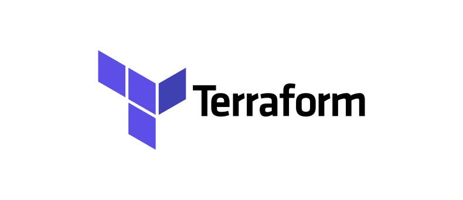

## Terraform - Criação de Bucket no S3 para site estático



Este projeto cria um bucket S3 na AWS para hospedar um site estático usando o Terraform.

## 🚀 Funcionalidades
- Criação de um bucket S3 configurado para site estático
- Configuração de permissões públicas para o bucket
- Definição de política de controle de propriedade do bucket

## 📂 Estrutura do Projeto
```
├── main.tf          # Código principal do Terraform
├── variables.tf     # Definição de variáveis
└── README.md        # Documentação do projeto
```

## 🔧 Pré-requisitos
- Terraform instalado
- Conta AWS configurada (credenciais no `~/.aws/credentials`)

## 🚦 Como usar
1. Clone o repositório:
```bash
git clone <URL_DO_REPOSITORIO>
cd nome-do-repositorio
```

2. Configure o nome do bucket no arquivo `variables.tf`:
```hcl
variable "bucket_name" {
    type = string
    default = "meu-bucket"
}
```

3. Inicialize o Terraform:
```bash
terraform init
```

4. Faça o plano de execução:
```bash
terraform plan
```

5. Aplique as mudanças para criar os recursos:
```bash
terraform apply
```

## 🗑️ Como destruir os recursos
```bash
terraform destroy
```

## 📄 Notas
- Certifique-se de que a região AWS (`us-east-1`) esteja disponível para o seu perfil.
- O bucket S3 será acessível publicamente para exibir o site estático.


